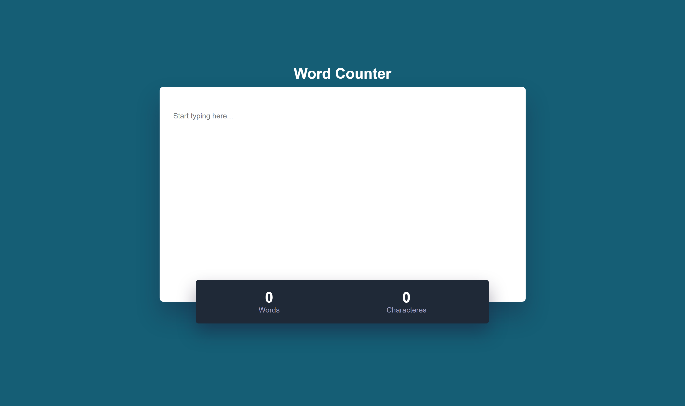

<h1 align="center"> Word Counter </h1>

  

  &nbsp;&nbsp;&nbsp;|&nbsp;&nbsp;&nbsp;
      <a href="#-projeto">Projeto</a>&nbsp;&nbsp;&nbsp;|&nbsp;&nbsp;&nbsp;
  <a href="#-tecnologias">Tecnologias</a>&nbsp;&nbsp;&nbsp;|&nbsp;&nbsp;&nbsp;
  <a href="#memo-licença">Licença</a>&nbsp;&nbsp;&nbsp;|&nbsp;&nbsp;&nbsp;

  

 

## 👩🏻‍💻 Projeto

Projeto de um contador de palavras e caracteres

[🔗 É possível acessar o projeto clicando aqui 🔤](https://robotron2000-peach.vercel.app/)

## 🚀 Tecnologias

Esse projeto foi desenvolvido com as seguintes tecnologias:

- HTML e CSS
- JavaScript

## :memo: Licença

Esse projeto está sob a licença MIT.

---
#### Feito com ♥ by Fernanda Dias

  

